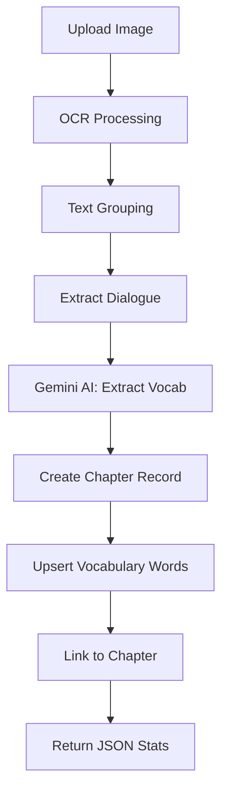
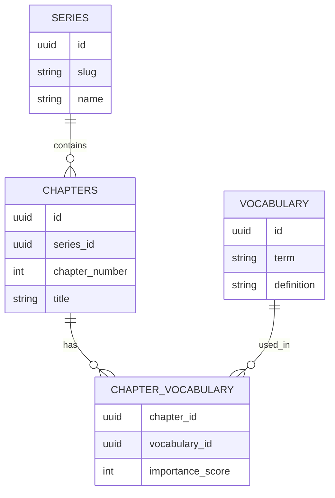

# Process Image & Store Vocabulary Endpoint

## Overview

Create `/process-image-and-store` endpoint that combines OCR processing, AI vocabulary extraction, and database storage.

## Architecture




## Database Operations




## Implementation Steps

### 1. Create New Service File

**File**: [`services/imageVocabularyProcessor.ts`](services/imageVocabularyProcessor.ts)Main processing function that:

- Accepts image path, series info, chapter number
- Calls existing OCR + grouping logic from [`services/main.ts`](services/main.ts)
- Extracts dialogue using `getDialogueFromGroupedText()`
- Calls Gemini API via [`gemini-api/create.ts`](gemini-api/create.ts) `createWordList()`
- Returns vocabulary with importance scores

### 2. Create Database Handler

**File**: [`supabase/vocabularyHandler.ts`](supabase/vocabularyHandler.ts)Database operations using types from [`supabase/types/database.types.ts`](supabase/types/database.types.ts):

- **`createChapter(series_id, chapter_number, title?)`**: Insert new chapter record, return chapter_id
- **`insertNewVocabulary(words)`**: Insert only new vocabulary terms (check existing first), return all vocab IDs with their terms
- **`linkVocabularyToChapter(chapter_id, vocabData)`**: Bulk insert into `chapter_vocabulary` junction table with importance scores
- **`getChapterStats(chapter_id)`**: Count total words for chapter, fetch series slug and chapter number

### 3. Create New Endpoint

**File**: [`services/processImageAndStore.ts`](services/processImageAndStore.ts) or add to existing endpoint file**Endpoint**: `POST /process-image-and-store`**Request**:

- Multipart form data with image file
- Query params (required): 
- `series_slug` (string) - Series identifier
- `chapter_number` (number) - Chapter number
- `user_id` (string) - User ID (for future features)
- Optional: `chapter_title` (string)

**Processing Flow**:

1. Parse multipart form data and save image to temp file
2. Lookup `series_id` from `series_slug` via Supabase query
3. Call `processImageForOCR(tempImagePath)` from [`services/ocr-api/index.ts`](services/ocr-api/index.ts)
4. Call `processAndGroupOcrResults(ocrResults)` from [`services/text-grouper/textGrouper.ts`](services/text-grouper/textGrouper.ts)
5. Call `getDialogueFromGroupedText(groupedData)` to extract dialogue lines
6. Convert dialogue array to single string (join with newlines)
7. Call `createWordList(dialogue)` from [`gemini-api/create.ts`](gemini-api/create.ts) - returns Word array with korean, english, importanceScore
8. Call `createChapter(series_id, chapter_number, title?)` - returns new chapter_id
9. Call `insertNewVocabulary(words)` - checks existing terms, inserts new ones, returns all vocabulary IDs mapped to terms
10. Map vocabulary IDs to importance scores and call `linkVocabularyToChapter(chapter_id, vocabData)`
11. Call `getChapterStats(chapter_id)` to get final counts and series info
12. Clean up temp file
13. Return JSON response

**Response**:

```typescript
{
  newWordsInserted: number,      // Words newly added to vocabulary table
  totalWordsInChapter: number,   // Total words linked to this chapter
  seriesSlug: string,
  chapterNumber: number
}
```


### 4. Update Types

**File**: [`services/types.ts`](services/types.ts)Add response interface:

```typescript
export interface ProcessImageAndStoreResponse {
  newWordsInserted: number;
  totalWordsInChapter: number;
  seriesSlug: string;
  chapterNumber: number;
}
```


### 5. Register Service

**File**: Create [`services/processImageStore/encore.service.ts`](services/processImageStore/encore.service.ts)Register the new endpoint as an Encore service.

## Key Implementation Details

### Database Types

Import and use types from [`supabase/types/database.types.ts`](supabase/types/database.types.ts):

```typescript
import type { Tables, TablesInsert } from '../supabase/types/database.types';

type VocabularyRow = Tables<'vocabulary'>;
type VocabularyInsert = TablesInsert<'vocabulary'>;
type ChapterInsert = TablesInsert<'chapters'>;
type ChapterVocabularyInsert = TablesInsert<'chapter_vocabulary'>;
```


### Vocabulary Upsert Logic

Since homonyms exist, we keep existing vocabulary entries. For each word from Gemini:

1. Check if term exists
2. Insert only if new
3. Return all vocabulary IDs (both existing and newly inserted)
```typescript
// Check existing terms
const existingTerms = await supabase
  .from('vocabulary')
  .select('id, term')
  .in('term', words.map(w => w.korean));

// Insert only new terms
const newWords = words.filter(w => !existingTerms.find(e => e.term === w.korean));
const { data: inserted } = await supabase
  .from('vocabulary')
  .insert(newWords.map(w => ({ term: w.korean, definition: w.english })))
  .select('id, term');

// Combine existing + new for linking
const allVocabIds = [...existingTerms, ...inserted];
```


### Batch Insert Chapter Vocabulary

```typescript
const insertData = vocabularyIds.map((vocabId, idx) => ({
  chapter_id: chapterId,
  vocabulary_id: vocabId,
  importance_score: words[idx].importanceScore
}));

await supabase.from('chapter_vocabulary').insert(insertData);
```


### Count New Words

Track which vocabulary IDs existed before vs. after upsert to calculate `newWordsInserted`.

## Files to Create/Modify

**Create**:

- `services/imageVocabularyProcessor.ts` - Main processing orchestrator
- `supabase/vocabularyHandler.ts` - Database operations
- `services/processImageStore/encore.service.ts` - Service registration
- `services/processImageStore/processImageAndStore.ts` - Endpoint handler

**Modify**:

- `services/types.ts` - Add response type

**Reuse** (no changes):

- `services/ocr-api/index.ts`